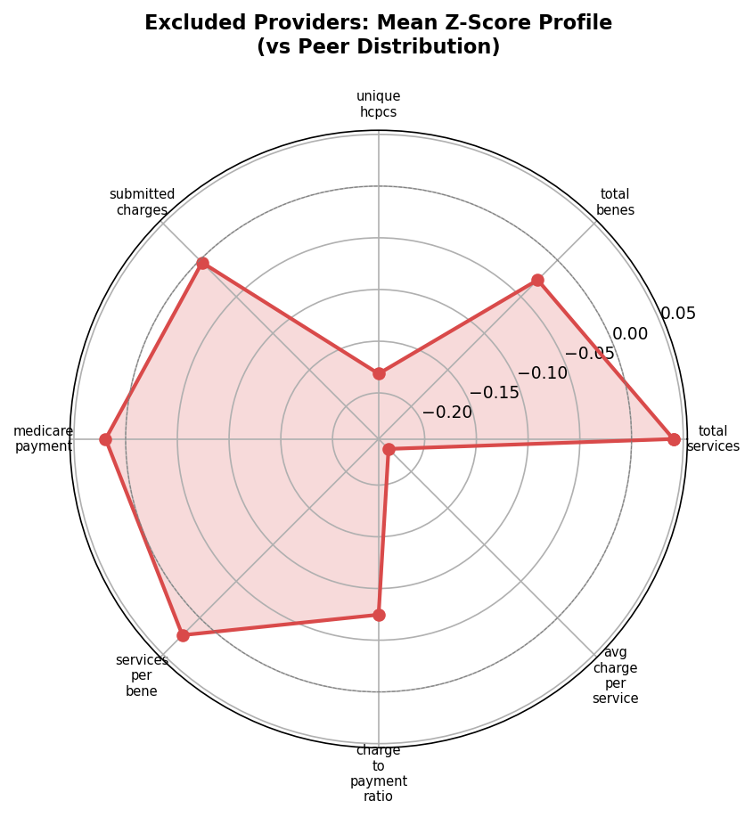
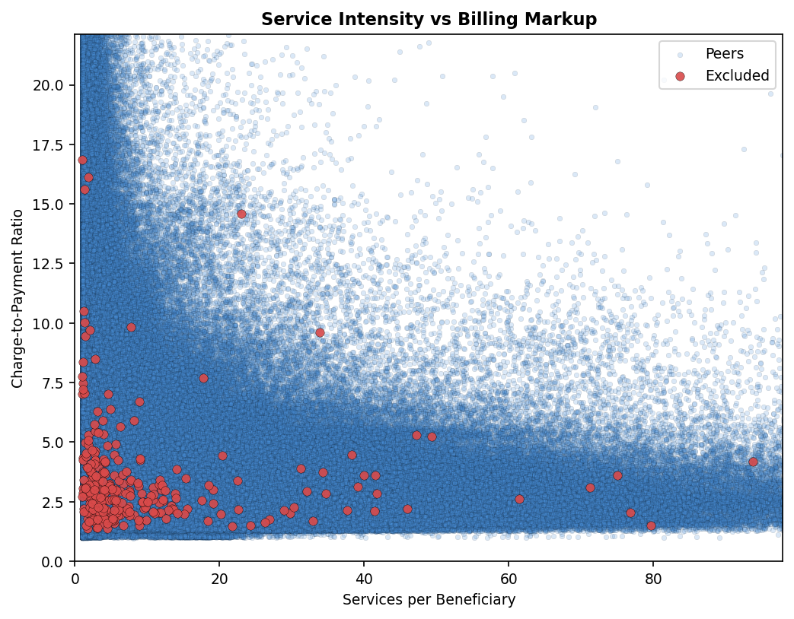
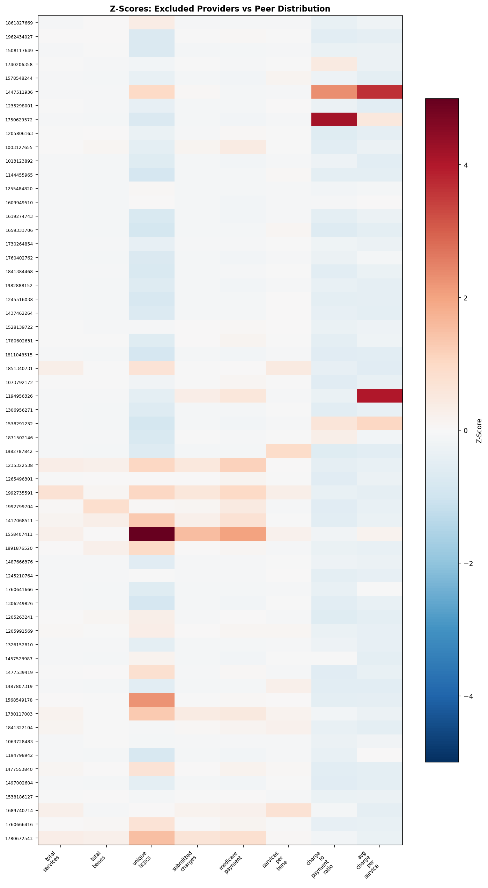
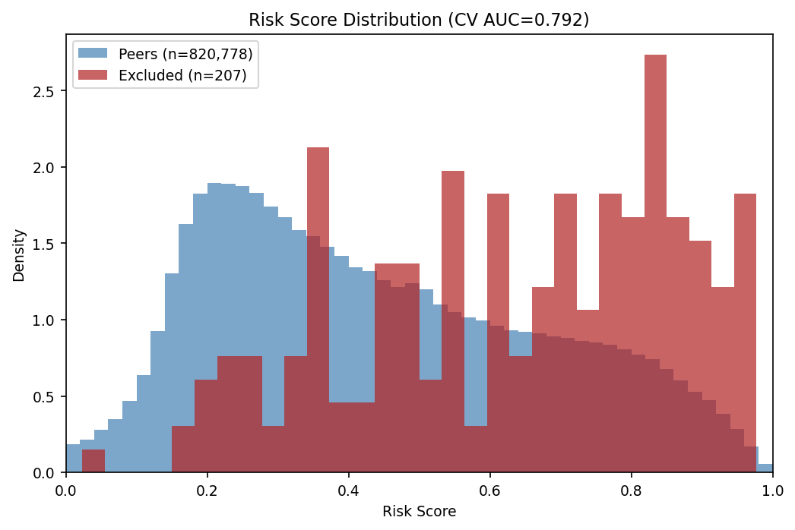
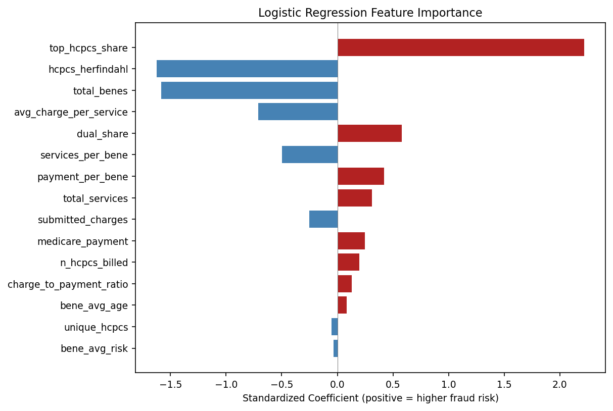

# Medicare Fraud Backtest POC — Results

**Generated:** 2026-05-18 10:07

## Cohort Summary

- **Excluded providers matched to Part B billing:** 289
- **Peer providers (same state/specialty/year):** 3,393,547
- **States:** 41 states
- **Exclusion date range:** 2018-2023
- **Billing data:** best available pre-exclusion year per provider

### By State

| State | Excluded | Peers |
|-------|----------|-------|
| AL | 5 | 34,303 |
| AZ | 3 | 37,390 |
| CA | 31 | 440,417 |
| CO | 1 | 15,424 |
| CT | 2 | 12,815 |
| DE | 1 | 3,287 |
| FL | 30 | 270,177 |
| GA | 11 | 92,063 |
| HI | 2 | 6,120 |
| IA | 2 | 19,025 |
| ID | 1 | 5,024 |
| IL | 17 | 222,210 |
| IN | 2 | 36,013 |
| KS | 2 | 17,103 |
| KY | 5 | 38,918 |
| LA | 5 | 34,994 |
| MA | 2 | 56,004 |
| MD | 4 | 36,858 |
| ME | 1 | 5,510 |
| MI | 23 | 193,629 |
| MN | 1 | 20,329 |
| MO | 4 | 51,541 |
| MS | 3 | 14,309 |
| MT | 1 | 3,720 |
| NC | 4 | 92,101 |
| NJ | 6 | 83,894 |
| NM | 1 | 5,334 |
| NV | 2 | 13,096 |
| NY | 22 | 388,424 |
| OH | 16 | 216,785 |
| OK | 1 | 9,302 |
| PA | 16 | 265,974 |
| PR | 5 | 16,248 |
| SC | 3 | 26,269 |
| SD | 1 | 3,276 |
| TN | 12 | 100,405 |
| TX | 30 | 337,740 |
| UT | 1 | 6,793 |
| VA | 6 | 110,771 |
| WI | 2 | 39,054 |
| WV | 2 | 10,898 |

### Excluded Providers

Click to expand (all providers)

| NPI | Name | State | Specialty | Excl Type | Excl Date | Billing Year |
|-----|------|-------|-----------|-----------|-----------|-------------|
| 1437418506 | ARROW-MED AMBULANCE, INC. | KY | AMBULANCE COMPANY | 1128a1 | 2019-12-19 | 2018 |
| 1871502146 | BALBOA AMBULANCE INC. | CA | AMBULANCE COMPANY | 1128b7 | 2021-12-07 | 2020 |
| 1285651638 | BESTCARE LABORATORY SERVICES, LLC | TX | LABORATORY | 1128b7 | 2021-01-26 | 2018 |
| 1326091760 | EASTERN AREA SPECIALTY TRANSPORT, INC. | OH | TRANSPORTATION CO | 1128b7 | 2019-11-01 | 2018 |
| 1598746919 | LAKESHORE DIAGNOSTICS ULTRASOUND CO. | MI | LABORATORY-IDTF | 1128b7 | 2019-11-08 | 2018 |
| 1477094274 | LAWRENCE MED LAB LLC | MA | LAB - CLINICAL | 1128a1 | 2023-06-20 | 2019 |
| 1558707331 | UNICARE AMBULANCE LLC | PA | AMBULANCE COMPANY | 1128b7 | 2019-07-08 | 2018 |
| 1982836581 | UNITED MEDICAL RESPONSE LLC | GA | AMBULANCE COMPANY | 1128b7 | 2023-10-16 | 2019 |
| 1003127655 | MOUSTAFA ABOSHADY | CA | INTERNAL MEDICINE | 1128a1 | 2019-09-19 | 2018 |
| 1447286158 | WAEL ABOUGHALI | TX | FAMILY PRACTICE | 1128a1 | 2023-11-20 | 2022 |
| 1760666416 | ARMAN ABOVYAN | FL | INTERNAL MEDICINE | 1128a3 | 2022-05-19 | 2018 |
| 1891887048 | KAMEL ABRAHAM | OH | ANESTHESIOLOGY | 1128a1 | 2022-03-20 | 2020 |
| 1972505626 | HAL ABRAHAMSON | NY | PODIATRY | 1128a1 | 2021-01-20 | 2018 |
| 1558562363 | JOHN AGBI | FL | INTERNAL MEDICINE | 1128a1 | 2021-01-20 | 2019 |
| 1326008384 | ISHTIAQ AHMAD | VA | PAIN MANAGEMENT | 1128a1 | 2019-04-18 | 2018 |
| 1245210764 | SHEIKH AHMED | CT | PEDIATRICS | 1128a1 | 2018-11-20 | 2017 |
| 1861827669 | LILIAN AKWUBA | AL | NURSE PRACTITIONER ( | 1128a1 | 2020-01-20 | 2017 |
| 1679524789 | MICHAEL ALEXANDER | OH | PAIN MANAGEMENT | 1128a1 | 2022-03-20 | 2019 |
| 1700813607 | IFTIKHAR ALI | MO | INTERNAL MEDICINE | 1128a1 | 2023-12-20 | 2022 |
| 1982888152 | KEYVAN AMIRIKHORHEH | CA | GENERAL PRACTICE | 1128a1 | 2022-04-20 | 2018 |
| 1922005990 | SUHYUN AN | TX | CHIROPRACTIC | 1128b7 | 2021-05-27 | 2020 |
| 1639358328 | JOSEPH ANDRES | NY | PHYSICAL THERAPY | 1128a1 | 2022-12-20 | 2017 |
| 1013074525 | EWALD ANTOINE | NY | INTERNAL MEDICINE | 1128a1 | 2020-01-20 | 2017 |
| 1144242090 | LINUS ANUKWU | IL | SURGERY | 1128a1 | 2023-10-19 | 2022 |
| 1548286750 | DIANE ARDITO | NY | PSYCHOLOGY | 1128a1 | 2023-08-20 | 2021 |
| 1356530380 | STEVEN ARNOLD | OH | FAMILY PRACTICE | 1128a1 | 2023-11-20 | 2022 |
| 1558407411 | JOEL ARONOWITZ | CA | PLASTIC SURGERY | 1128b7 | 2023-04-14 | 2022 |
| 1831339902 | GAUTAM ARORA | NY | PAIN MANAGEMENT | 1128a1 | 2022-03-20 | 2017 |
| 1194716001 | ADAM ARREDONDO | TX | PAIN MANAGEMENT | 1128a1 | 2022-04-20 | 2021 |
| 1194706754 | WILSON ASFORA MD FRCSC PC | SD | NEUROLOGY | 1128b7 | 2021-04-30 | 2019 |
| 1306906854 | ZAHID ASLAM | MD | GYN/OBS | 1128b7 | 2018-11-30 | 2017 |
| 1386634293 | SYED AZIZ | TX | INTERNAL MEDICINE | 1128a1 | 2020-06-18 | 2019 |
| 1871672485 | CATHY BAGLEY | SC | GENERAL PRACTICE | 1128a1 | 2021-07-20 | 2017 |
| 1376505164 | MANUEL BARIT | WV | GENERAL PRACTICE | 1128a1 | 2020-03-19 | 2019 |
| 1154454601 | DONNA BARKER | IL | NURSE PRACTITIONER ( | 1128b7 | 2023-10-02 | 2021 |
| 1851433460 | GRAY BARROW | LA | PAIN MANAGEMENT | 1128a1 | 2022-08-18 | 2018 |
| 1427048701 | MARY BARTEK | PA | CHIROPRACTIC | 1128a1 | 2023-08-20 | 2022 |
| 1134392145 | Renato Battisti | NY | CHIROPRACTIC | 1128a3 | 2023-12-20 | 2022 |
| 1952454928 | ANDREW BERKOWITZ | PA | INTERNAL MEDICINE | 1128a1 | 2020-03-30 | 2019 |
| 1295718138 | ROGER BEYER | MI | GYN/OBS | 1128a1 | 2022-01-19 | 2019 |
| 1417068511 | BHUPINDER BHANDARI | CA | GENERAL PRACTICE | 1128a1 | 2023-06-20 | 2022 |
| 1922062181 | EMAD BISHAI | TX | PAIN MANAGEMENT | 1128b7 | 2021-11-08 | 2019 |
| 1801203005 | CELESTE BLAND-GUARY | MD | SOCIAL WORKER | 1128a1 | 2020-03-19 | 2018 |
| 1376516609 | PAUL BOLGER | IL | EMERGENCY MEDICINE | 1128a3 | 2019-08-20 | 2017 |
| 1023272994 | MANISH BOLINA | MI | PAIN MANAGEMENT | 1128a1 | 2023-01-19 | 2018 |
| 1457523987 | PETER BOLOS | FL | PHYSICIAN PRACTICE ( | 1128a3 | 2023-04-20 | 2017 |
| 1841332012 | VARANISE BOOKER | KY | FAMILY PRACTICE | 1128a1 | 2023-11-20 | 2017 |
| 1982644548 | VANCY BRIDGES | TX | FAMILY PRACTICE | 1128a1 | 2022-05-19 | 2019 |
| 1760425458 | ANDRE BRUTUS | NY | INTERNAL MEDICINE | 1128a1 | 2023-09-20 | 2022 |
| 1336195825 | NICHOLAS BUFANIO | PA | CHIROPRACTIC | 1128a3 | 2022-02-20 | 2020 |
| 1629219969 | MICHAEL BUMMER | PA | GYN/OBS | 1128a1 | 2020-06-18 | 2017 |
| 1902858848 | KAREN BUTLER | GA | FAMILY PRACTICE | 1128a1 | 2022-03-20 | 2019 |
| 1538164942 | CHRISTOPHER CALENDINE | TN | PEDIATRICS | 1128a3 | 2019-04-18 | 2018 |
| 1144222068 | JONI CANBY | OH | GYN/OBS | 1128a1 | 2023-11-20 | 2021 |
| 1144455965 | JOSERODEL CANDELARIO | CA | CHIROPRACTIC | 1128a1 | 2022-01-19 | 2018 |
| 1376854968 | EDUARDO CANOVA | TX | INTERNAL MEDICINE | 1128a1 | 2022-12-20 | 2021 |
| 1952301699 | THOMAS CARPENTER | FL | FAMILY PRACTICE | 1128a1 | 2022-03-20 | 2020 |
| 1811048515 | BRIAN CARRICO | CA | CHIROPRACTIC | 1128a3 | 2023-01-19 | 2019 |
| 1245265214 | MICHAEL CASH | PA | FAMILY PRACTICE | 1128a1 | 2022-07-20 | 2017 |
| 1194801662 | ANIS CHALHOUB | KY | CARDIOLOGY | 1128a1 | 2019-02-20 | 2018 |
| 1619274743 | MARCO CHAVEZ | CA | NEPHROLOGY | 1128a3 | 2021-01-20 | 2018 |
| 1740533728 | JAEWOOK CHOI | NY | PHYSICAL THERAPY | 1128a1 | 2023-10-19 | 2020 |
| 1922484294 | FELICIA CIAMACCO | OH | PHYSICIAN ASSISTANT | 1128a1 | 2022-11-20 | 2019 |
| 1578548244 | JOHN CIMINO | AL | GYN/OBS | 1128a3 | 2022-03-20 | 2019 |
| 1811934318 | WENDY CIPRIANI | NC | FAMILY PRACTICE | 1128a1 | 2023-11-20 | 2022 |
| 1881736593 | JOHN CLARK | LA | PAIN MANAGEMENT | 1128a1 | 2020-02-05 | 2017 |
| 1801079686 | STEVEN CLARK | MI | SOCIAL WORKER | 1128a1 | 2021-04-20 | 2019 |
| 1346527496 | TAYLOR CLEMENT | MT | SOCIAL WORKER | 1128a1 | 2023-11-20 | 2018 |
| 1487807319 | PIERRE CLERMONT | FL | PHYSICAL THERAPY | 1128a1 | 2019-04-18 | 2017 |
| 1023150422 | ANGELA COLEMAN | GA | INTERNAL MEDICINE | 1128a1 | 2022-05-19 | 2019 |
| 1255322970 | ROBERT COLEMAN | KS | GENERAL PRACTICE | 1128a1 | 2023-01-19 | 2020 |
| 1982693511 | RICHARD COSTA | NJ | FAMILY PRACTICE | 1128a1 | 2023-08-20 | 2022 |
| 1093023145 | BRENDON COX | UT | THERAPIST | 1128a1 | 2023-07-20 | 2019 |
| 1962434027 | STEVEN COX | AL | NURSE PRACTITIONER ( | 1128a3 | 2019-06-20 | 2017 |
| 1922047489 | JAMES CRABB | TN | FAMILY PRACTICE | 1128a1 | 2021-07-20 | 2019 |
| 1639172307 | BING CROSBY | KY | CHIROPRACTIC | 1128a1 | 2019-06-20 | 2017 |
| 1609996982 | LARRY CRUEL | MS | PODIATRY | 1128a1 | 2022-11-20 | 2018 |
| 1972685758 | CESAR CUBANO | PR | PSYCHIATRY | 1128a1 | 2023-08-20 | 2022 |
| 1548427164 | GERALD DANESHVAR | MI | GENERAL PRACTICE | 1128a1 | 2018-09-20 | 2017 |
| 1205263241 | WILLIAM DANZEISEN | FL | PODIATRY | 1128a1 | 2019-05-20 | 2017 |
| 1386687556 | TAPAS DASGUPTA | IL | INTERNAL MEDICINE | 1128a1 | 2022-02-20 | 2019 |
| 1497852743 | RICHARD DAVIDSON | FL | CHIROPRACTIC | 1128a1 | 2022-03-20 | 2020 |
| 1821009390 | RICHARD DELACRUZ | FL | GENERAL PRACTICE | 1128a1 | 2021-01-20 | 2020 |
| 1063728483 | MEGAN DELIMATA | FL | INTERNAL MEDICINE | 1128a1 | 2020-02-20 | 2018 |
| 1801891007 | KEDAR DESHPANDE | OH | PAIN MANAGEMENT | 1128a1 | 2022-04-20 | 2020 |
| 1477553840 | CHRISTOPHER DEVINE | FL | FAMILY PRACTICE | 1128a3 | 2019-08-20 | 2018 |
| 1942287735 | BRETT DICKINSON | MO | FAMILY PRACTICE | 1128b7 | 2022-07-21 | 2021 |
| 1184611725 | ANH DO | TX | GENERAL PRACTICE | 1128a1 | 2020-07-20 | 2017 |
| 1932162716 | UZMA EHTESHAM | VA | GENERAL PRACTICE | 1128a1 | 2022-04-20 | 2020 |
| 1316030661 | BASSAM EL-BORNO | PA | PSYCHIATRY | 1128a1 | 2020-12-20 | 2018 |
| 1013095975 | ANTHONY ENRICO | NJ | PODIATRY | 1128a1 | 2019-01-20 | 2017 |
| 1295705291 | NOBLE EZUKANMA | TX | INTERNAL MEDICINE | 1128a1 | 2018-01-18 | 2017 |
| 1942495080 | JAMES FERRIS | OK | FAMILY PRACTICE | 1128a1 | 2021-04-20 | 2017 |
| 1710063797 | MARK FILIPPONE | NJ | PAIN MANAGEMENT | 1128a3 | 2021-11-18 | 2019 |
| 1386197507 | TINA FOLDEN | NM | NURSE PRACTITIONER ( | 1128a1 | 2021-11-18 | 2019 |
| 1205932753 | TIFFANNI FORBES | GA | INTERNAL MEDICINE | 1128a1 | 2022-11-20 | 2019 |
| 1073624912 | LEO FRANGIPANE | GA | EMERGENCY MEDICINE | 1128a1 | 2021-04-20 | 2018 |
| 1780672543 | MICHAEL FREY | FL | PAIN MANAGEMENT | 1128a1 | 2019-11-20 | 2018 |
| 1912082504 | OLEG FUZAYLOV | NY | PAIN MANAGEMENT | 1128a1 | 2022-09-20 | 2019 |
| 1841248127 | DEENADAYAL GADDAM | IL | GENERAL PRACTICE | 1128a1 | 2019-09-19 | 2018 |
| 1750629572 | CANDICE GAITANIS | AZ | NURSE PRACTITIONER ( | 1128a1 | 2022-08-18 | 2020 |
| 1194956326 | ALEXANDER GERBAKHER | CA | DENTIST | 1128b7 | 2023-10-17 | 2020 |
| 1093700932 | FADI GHANEM | TX | FAMILY PRACTICE | 1128a3 | 2023-06-20 | 2019 |
| 1619959004 | MARK GIBBS | TX | FAMILY PRACTICE | 1128a1 | 2022-04-20 | 2021 |
| 1215049762 | RICHARD GREEN | PA | FAMILY PRACTICE | 1128a1 | 2022-12-20 | 2020 |
| 1467441584 | MARK GRIFFIS | GA | GENERAL PRACTICE | 1128a3 | 2021-10-20 | 2018 |
| 1093177503 | Sagy Grinberg | NJ | GENERAL PRACTICE | 1128a3 | 2023-11-20 | 2022 |
| 1760641666 | KAKRA GYAMBIBI | CT | EMERGENCY MEDICINE | 1128a3 | 2021-10-20 | 2017 |
| 1902895543 | TOD HAGINS | WV | PAIN MANAGEMENT | 1128a1 | 2019-01-20 | 2017 |
| 1447292297 | DOUGLAS HALL | TX | SOCIAL WORKER | 1128a1 | 2018-11-20 | 2017 |
| 1508968835 | ASIM HAMEEDI | NY | INTERNAL MEDICINE | 1128a3 | 2022-03-20 | 2020 |
| 1043241870 | YOLANDA HAMILTON | TX | INTERNAL MEDICINE | 1128a1 | 2021-03-18 | 2017 |
| 1962422329 | ABDUL HAQ | MI | PAIN MANAGEMENT | 1128a1 | 2023-01-19 | 2017 |
| 1548483670 | JIMMY HENRY | OH | PAIN MANAGEMENT | 1128a1 | 2022-11-20 | 2020 |
| 1588678437 | LAILA HIRJEE | TX | INTERNAL MEDICINE | 1128a1 | 2022-04-20 | 2021 |
| 1801853379 | YEE HO | PA | FAMILY PRACTICE | 1128a1 | 2022-10-20 | 2021 |
| 1104870229 | HOWARD HOFFBERG | MD | PAIN MANAGEMENT | 1128a1 | 2022-09-20 | 2018 |
| 1023156320 | KIRK HOPKINS | IL | PSYCHIATRY | 1128a1 | 2021-02-18 | 2018 |
| 1609949510 | TIMOTHY HUNT | CA | ORTHOPEDICS | 1128a3 | 2021-03-18 | 2018 |
| 1356540264 | John Hynes | SC | GENERAL PRACTICE | 1128a1 | 2023-07-20 | 2021 |
| 1326209354 | BERNADETTE IGUH | TX | GENERAL PRACTICE | 1128a1 | 2021-06-17 | 2020 |
| 1740673029 | ALEJANDRO INCERA | NV | NURSE/NURSES AIDE | 1128a1 | 2019-12-19 | 2017 |
| 1528139722 | BABAR IQBAL | CA | ANESTHESIOLOGY | 1128a3 | 2020-12-20 | 2019 |
| 1841322104 | JAYAM KRISHNA IYER | FL | ANESTHESIOLOGY | 1128a1 | 2018-08-24 | 2017 |
| 1003870239 | MUNAVVAR IZHAR | IL | NEPHROLOGY | 1128a1 | 2019-09-19 | 2017 |
| 1982956108 | SHELIA JACKSON | LA | PHYSICIAN PRACTICE ( | 1128a1 | 2022-08-18 | 2017 |
| 1538186127 | JOHN JANICK | FL | ENDOCRINOLOGY | 1128a1 | 2019-04-18 | 2018 |
| 1154514156 | KIRA JOHNSON | MS | SOCIAL WORKER | 1128a1 | 2019-08-20 | 2018 |
| 1205806163 | FRANKLYN JONES | CA | PODIATRY | 1128a1 | 2018-03-20 | 2017 |
| 1801005053 | MICHAEL JONES | LA | INTERNAL MEDICINE | 1128a1 | 2019-04-18 | 2018 |
| 1750420303 | RUTH JONES | PA | FAMILY PRACTICE | 1128a1 | 2022-07-20 | 2018 |
| 1891876520 | ROBERT JOSEPH | CA | PODIATRY | 1128a3 | 2023-09-20 | 2022 |
| 1013009729 | HAILU KABTIMER | TN | INTERNAL MEDICINE | 1128a1 | 2018-04-19 | 2017 |
| 1134221351 | VISHWAS KADAM | GA | INTERNAL MEDICINE | 1128a1 | 2021-01-20 | 2019 |
| 1598745838 | ANAND KALEPU | OH | SURGERY | 1128a1 | 2021-12-20 | 2019 |
| 1841384468 | KANAGASABAI KANAKESWARAN | CA | INTERNAL MEDICINE | 1128a1 | 2019-12-19 | 2018 |
| 1386670461 | GUCHARAN KANWAL | VA | INTERNAL MEDICINE | 1128a1 | 2018-08-20 | 2017 |
| 1306249826 | SACHIN KARNIK | DE | SOCIAL WORKER | 1128a1 | 2019-03-20 | 2018 |
| 1568497139 | JERRY KEEPERS | TX | ANESTHESIOLOGY | 1128a1 | 2023-12-20 | 2021 |
| 1801937545 | MOHAMMAD KHAN | IL | INTERNAL MEDICINE | 1128a1 | 2019-08-20 | 2017 |
| 1245276351 | MARK KHOURY | MI | PODIATRY | 1128a1 | 2022-12-20 | 2018 |
| 1629179312 | AVIAN KIDD | TX | INTERNAL MEDICINE | 1128a1 | 2022-08-18 | 2021 |
| 1891949368 | TAE KIM | NY | PHYSICAL THERAPY | 1128a1 | 2023-12-20 | 2021 |
| 1073772638 | TAEGYUN KIM | NY | INTERNAL MEDICINE | 1128a1 | 2022-03-20 | 2019 |
| 1518246669 | STEPHANIE KING | PA | NURSE/NURSES AIDE | 1128a1 | 2023-07-20 | 2020 |
| 1407851876 | AMY KIRK | OH | NURSE/NURSES AIDE | 1128a1 | 2020-10-20 | 2019 |
| 1013123892 | GLENN KISSINGER | CA | INTERNAL MEDICINE | 1128a1 | 2022-03-20 | 2018 |
| 1063584944 | GARY KLEIN | MI | PODIATRY | 1128a1 | 2023-05-18 | 2020 |
| 1740589258 | YEKATERINA KLEYDMAN | NY | DERMATOLOGY | 1128a1 | 2022-10-20 | 2018 |
| 1235322538 | MINAS KOCHUMIAN | CA | INTERNAL MEDICINE | 1128a1 | 2022-11-20 | 2021 |
| 1952395881 | VINCENT KOH | NY | ONCOLOGY | 1128a1 | 2018-10-18 | 2017 |
| 1659333706 | DAVID KONG | CA | CHIROPRACTIC | 1128a1 | 2019-04-18 | 2018 |
| 1992735591 | RICHARD KROOP | CA | INTERNAL MEDICINE | 1128a1 | 2023-01-19 | 2021 |
| 1205991569 | SHEETAL KANAR | FL | GYN/OBS | 1128a1 | 2020-01-20 | 2017 |
| 1013069780 | MARK KUPER | TX | ORTHOPEDICS | 1128a1 | 2021-05-20 | 2017 |
| 1497002604 | DARREN KURTZER | FL | AUDIOLOGY | 1128a3 | 2019-12-19 | 2018 |
| 1992799704 | FRANCIS LAGATTUTA | CA | PAIN MANAGEMENT | 1128b7 | 2023-07-07 | 2021 |
| 1073593919 | JOSEPH LATELLA | IA | FAMILY PRACTICE | 1128a1 | 2020-10-20 | 2019 |
| 1053733857 | KATELINE LAVACHE | FL | NURSE PRACTITIONER ( | 1128a1 | 2023-08-20 | 2019 |
| 1205879855 | CHARLES LEACH | TX | INTERNAL MEDICINE | 1128a1 | 2021-10-20 | 2017 |
| 1982743589 | ORLANDO LEIVA | FL | PHYSICIAN ASSISTANT | 1128a3 | 2022-09-20 | 2021 |
| 1639141120 | STUART LEWIS | FL | INTERNAL MEDICINE | 1128a3 | 2022-01-19 | 2020 |
| 1194798942 | DREW LIEBERMAN | FL | ANESTHESIOLOGY | 1128a3 | 2022-12-20 | 2018 |
| 1699854562 | MICHAEL LIGOTTI | FL | INTERNAL MEDICINE | 1128a3 | 2023-07-20 | 2019 |
| 1679502033 | CARL LINDBLAD | TN | EMERGENCY MEDICINE | 1128a3 | 2021-09-20 | 2018 |
| 1306919956 | MARK LIPETZ | HI | INTERNAL MEDICINE | 1128a1 | 2020-07-20 | 2019 |
| 1518958040 | ALFREDO LOPEZ | IN | NEUROLOGY | 1128a1 | 2019-11-20 | 2018 |
| 1063420529 | AHAD LOTFI | MI | CHIROPRACTIC | 1128a1 | 2019-09-19 | 2017 |
| 1568651453 | NANCY LUDWIG | ME | COUNSELING CENTER | 1128a1 | 2020-10-20 | 2019 |
| 1871526400 | ALFONSO LUEVANO | TX | FAMILY PRACTICE | 1128a1 | 2023-12-20 | 2022 |
| 1508117649 | BRANDY LUNSFORD | AL | NURSE PRACTITIONER ( | 1128a1 | 2022-12-20 | 2018 |
| 1720083900 | ANDREW LYNN | TN | PODIATRY | 1128a1 | 2023-10-19 | 2021 |
| 1780602631 | RODOLFO MAGSINO | CA | GENERAL PRACTICE | 1128a1 | 2020-11-19 | 2019 |
| 1609858539 | IJAZ MAHMOOD | KY | INTERNAL MEDICINE | 1128a1 | 2023-03-20 | 2019 |
| 1417091919 | JOSE MALDONADO | TX | FAMILY PRACTICE | 1128a1 | 2023-04-20 | 2022 |
| 1598781171 | RICHARD MALLIA | FL | GENERAL PRACTICE | 1128a1 | 2021-06-17 | 2019 |
| 1235298001 | CARL MALMQUIST | AZ | PHYSICAL THERAPY | 1128a1 | 2022-12-20 | 2020 |
| 1730117003 | GARY MARDER | FL | DERMATOLOGY | 1128a1 | 2019-05-20 | 2017 |
| 1891943536 | DENNY MARTIN | NY | NEUROLOGY | 1128a1 | 2023-07-20 | 2019 |
| 1649348343 | Mary-Helene Massullo | OH | GENERAL PRACTICE | 1128a1 | 2023-11-20 | 2021 |
| 1831140573 | SHERYAR MASUD | IL | CHIROPRACTIC | 1128a3 | 2020-12-20 | 2018 |
| 1831297530 | MELVIN MATHEWS BERMUDEZ | PR | PODIATRY | 1128a1 | 2022-09-20 | 2021 |
| 1922280254 | JAMI MAYHEW | IL | NURSE PRACTITIONER ( | 1128a1 | 2021-04-20 | 2020 |
| 1154300812 | JOSEPH MAYOTTE | IL | CHIROPRACTIC | 1128a3 | 2021-06-17 | 2017 |
| 1255344339 | THOMAS MAYS | MI | FAMILY PRACTICE | 1128a1 | 2023-06-20 | 2018 |
| 1124095666 | BAN MECHAEL | MI | GENERAL PRACTICE | 1128a1 | 2021-11-18 | 2019 |
| 1326187626 | JUAN MEDINA | NY | INTERNAL MEDICINE | 1128a1 | 2019-02-20 | 2018 |
| 1376692996 | MARK MEISTER | WI | CHIROPRACTIC | 1128a1 | 2023-02-20 | 2021 |
| 1356404909 | FELIX MELENDEZ ORTIZ | PR | FAMILY PRACTICE | 1128a1 | 2023-08-20 | 2019 |
| 1720438104 | RODNEY MESQUIAS | TX | HC CONGLOM - PARENT | 1128a1 | 2021-03-18 | 2017 |
| 1467443432 | MONTE MILLER | TX | PSYCHOLOGY | 1128a1 | 2020-01-20 | 2019 |
| 1306956271 | AKIKUR MOHAMMAD | CA | MARKETING FIRM | 1128a3 | 2023-11-20 | 2020 |
| 1831214535 | KURT MORAN | PA | GENERAL PRACTICE | 1128a3 | 2023-11-20 | 2020 |
| 1073792172 | GERALD MYINT | CA | GENERAL PRACTICE | 1128a1 | 2021-12-20 | 2020 |
| 1295735116 | PADMINI NAGARAJ | LA | PSYCHIATRY | 1128a1 | 2021-01-20 | 2019 |
| 1144212978 | HARCHARAN NARANG | TX | INTERNAL MEDICINE | 1128a3 | 2020-06-18 | 2018 |
| 1972596757 | ABDUL NAUSHAD | MO | PAIN MANAGEMENT | 1128a1 | 2023-06-20 | 2022 |
| 1063575561 | DANIEL NEVARRE | PA | SURGERY | 1128a1 | 2018-11-20 | 2017 |
| 1245516038 | ANTHONY NGO | CA | CHIROPRACTIC PRACT | 1128a1 | 2020-11-19 | 2019 |
| 1659562254 | DEBRA NIEUWKOOP | MI | NURSE PRACTITIONER ( | 1128a1 | 2023-05-18 | 2021 |
| 1730272709 | MATTHEW OKEKE | NV | GENERAL PRACTICE | 1128a1 | 2023-07-20 | 2022 |
| 1184619041 | BERNARD OPPONG | OH | PAIN MANAGEMENT | 1128a1 | 2022-03-20 | 2018 |
| 1831284470 | JEFFREY OSBOURNE | WI | PODIATRY | 1128a1 | 2018-03-20 | 2017 |
| 1003850603 | STEVEN OWENS | MI | FAMILY PRACTICE | 1128a1 | 2020-05-20 | 2019 |
| 1902825441 | ASHOK PATEL | MA | NEPHROLOGY | 1128a1 | 2019-06-20 | 2018 |
| 1811067275 | PRANAV PATEL | IL | INTERNAL MEDICINE | 1128a1 | 2022-12-20 | 2021 |
| 1538147723 | FRANK PATINO | MI | PAIN MANAGEMENT | 1128a1 | 2023-12-20 | 2018 |
| 1447725528 | ROMMEL PEREZ | MI | HOME HEALTH AGENCY | 1128a1 | 2023-04-20 | 2020 |
| 1528185303 | SOARIES PETERSON | MI | GENERAL PRACTICE | 1128a1 | 2023-05-18 | 2022 |
| 1437462264 | SEAN PHAM | CA | PHYS THERAPY PROVIDE | 1128a1 | 2023-03-20 | 2019 |
| 1265496301 | JUAN POSADA | CA | GENERAL PRACTICE | 1128a1 | 2023-03-20 | 2021 |
| 1073584686 | JAMES PROMMERSBERGER | OH | PODIATRY | 1128a1 | 2022-01-19 | 2020 |
| 1730264854 | NIRMAL RAI | CA | GENERAL PRACTICE | 1128a1 | 2019-03-20 | 2018 |
| 1386626968 | MANGALA RAMAMURTHY | TX | INTERNAL MEDICINE | 1128a1 | 2020-08-20 | 2019 |
| 1780984609 | Barry Redford | ID | SOCIAL WORKER | 1128a1 | 2022-06-20 | 2021 |
| 1598701633 | JUDITH MORALE | NY | PHYSICAL THERAPY | 1128a1 | 2018-07-19 | 2017 |
| 1194723601 | KLAUS RENTROP | NY | CARDIOLOGY | 1128b7 | 2023-09-15 | 2022 |
| 1366431660 | MILAGROS RIVERA | GA | GENERAL PRACTICE | 1128a1 | 2021-07-20 | 2017 |
| 1144324690 | MIGUEL RIVERA | PR | PSYCHIATRY | 1128a1 | 2022-05-19 | 2017 |
| 1104829639 | JOSEPH RIZZO | TX | CARDIOLOGY | 1128b7 | 2020-09-30 | 2019 |
| 1093164311 | ROBBIE ROBINSON | IA | NURSE PRACTITIONER ( | 1128a1 | 2022-01-19 | 2020 |
| 1780764423 | NELSA RODRIGUEZ CESPEDES | PR | PSYCHIATRY | 1128a1 | 2022-07-20 | 2021 |
| 1417006842 | LEONARD ROSEN | VA | GYN/OBS | 1128a3 | 2022-11-20 | 2021 |
| 1538291232 | RANDY ROSEN | CA | PAIN MANAGEMENT | 1128a3 | 2023-11-20 | 2020 |
| 1477539419 | MICHAEL ROTSTEIN | FL | PODIATRY | 1128a1 | 2019-05-20 | 2017 |
| 1144629072 | BOBBY ROUSE | TN | COMM MNTL HLTH CNTR | 1128a1 | 2021-08-19 | 2017 |
| 1447511936 | ROBERT ROWLETT | AZ | ACUPUNCTURIST | 1128a3 | 2022-03-20 | 2019 |
| 1699721829 | PERRY RUDICH | IL | RADIOLOGY | 1128b7 | 2023-12-15 | 2022 |
| 1821123803 | JASON RUNYAN | FL | NURSE PRACTITIONER ( | 1128a1 | 2021-11-18 | 2020 |
| 1720242407 | HUSSEIN SAAD | MI | PAIN MANAGEMENT | 1128a1 | 2023-01-19 | 2018 |
| 1689740714 | CLARA SALAZAR-VUST | FL | PHYSICIAN ASSISTANT | 1128a3 | 2022-06-20 | 2018 |
| 1588928477 | JAWAD SALIM | GA | INTERNAL MEDICINE | 1128a1 | 2021-10-20 | 2020 |
| 1215939798 | EUGENE SALTZBERG | IL | EMERGENCY MEDICINE | 1128b7 | 2023-05-11 | 2018 |
| 1083654669 | GARFIELD SAMUELS | VA | INTERNAL MEDICINE | 1128a1 | 2023-12-20 | 2022 |
| 1033298252 | PARMINDERJEET SANDHU | NJ | FAMILY PRACTICE | 1128a1 | 2022-03-20 | 2017 |
| 1629042304 | BENJAMIN SANFORD | MS | RHEUMATOLOGY | 1128a1 | 2022-08-18 | 2021 |
| 1578558748 | RAMESH SARVAIYA | NJ | ANESTHESIOLOGY | 1128a3 | 2021-04-20 | 2019 |
| 1134102171 | BHUPINDER SAWHNY | OH | NEUROLOGY | 1128a1 | 2023-11-20 | 2019 |
| 1700886827 | FATIMA SAYEED | TX | FAMILY PRACTICE | 1128a1 | 2022-01-19 | 2018 |
| 1255306973 | NADEM SAYEGH | NY | INTERNAL MEDICINE | 1128a1 | 2021-01-20 | 2018 |
| 1740206358 | NICOLE SCRUGGS | AL | INTERNAL MEDICINE | 1128a1 | 2020-01-20 | 2018 |
| 1477842987 | JUSTIN SEGREST | NC | NURSE PRACTITIONER ( | 1128a1 | 2023-12-20 | 2021 |
| 1467501932 | JORGE SFEIR | IL | GYN/OBS | 1128a1 | 2021-09-20 | 2017 |
| 1568549178 | RAKESH SHARMA | FL | FAMILY PRACTICE | 1128a1 | 2021-02-18 | 2017 |
| 1609849306 | KOFI SHAW-TAYLOR | MD | PAIN MANAGEMENT | 1128a1 | 2019-05-20 | 2017 |
| 1902964331 | RONALD SHEPPARD | IN | CHIROPRACTIC PRACT | 1128a1 | 2018-04-19 | 2017 |
| 1609838085 | UDAYA SHETTY | VA | PSYCHIATRY | 1128a1 | 2019-10-31 | 2018 |
| 1093988008 | JAY SHIRES | TN | FAMILY PRACTICE | 1128a3 | 2023-12-20 | 2022 |
| 1881033280 | DOUGLAS SHREWSBURY | OH | NURSE/NURSES AIDE | 1128a1 | 2020-11-19 | 2017 |
| 1821058827 | STEVEN SIMON | KS | PAIN MANAGEMENT | 1128a1 | 2021-10-20 | 2017 |
| 1760402762 | MICHAEL SINEL | CA | PAIN MANAGEMENT | 1128a1 | 2021-08-19 | 2018 |
| 1770578262 | BARRY SLOAN | NY | GENERAL PRACTICE | 1128a1 | 2022-07-20 | 2018 |
| 1326152810 | GARY SMALL | FL | PODIATRY | 1128a3 | 2020-02-20 | 2017 |
| 1093904914 | GARY SMITH | GA | GENERAL PRACTICE | 1128b7 | 2021-05-25 | 2020 |
| 1104898634 | MICHAEL SMITH | NC | FAMILY PRACTICE | 1128a1 | 2018-07-20 | 2017 |
| 1255447215 | USHA SOOD | MI | DERMATOLOGY | 1128a1 | 2020-01-20 | 2018 |
| 1992999759 | DINO SORIANO | GA | NURSE PRACTITIONER ( | 1128a1 | 2020-07-20 | 2019 |
| 1134192370 | ROBERT STREMMEL | PA | FAMILY PRACTICE | 1128a1 | 2020-03-19 | 2018 |
| 1437240603 | THOMAS STURDAVANT | TN | GENERAL PRACTICE | 1128a3 | 2022-03-20 | 2019 |
| 1346389780 | MICHAEL TAITT | NY | INTERNAL MEDICINE | 1128a1 | 2020-03-19 | 2017 |
| 1851340731 | MARK TAMARIN | CA | UROLOGY | 1128a1 | 2020-11-19 | 2019 |
| 1255484820 | JACOB TAUBER | CA | ORTHOPEDICS | 1128a3 | 2022-12-20 | 2018 |
| 1467519124 | CHRISTINE THOMAS | NC | NURSE/NURSES AIDE | 1128a1 | 2018-03-20 | 2017 |
| 1184770208 | YEVGENY TSYRULNIKOV | IL | INTERNAL MEDICINE | 1128a1 | 2022-01-19 | 2021 |
| 1598789422 | APRIL TYLER | MI | FAMILY PRACTICE | 1128a1 | 2023-01-19 | 2018 |
| 1487666376 | John Tyler | CO | PAIN MANAGEMENT | 1128a1 | 2022-09-20 | 2020 |
| 1477583797 | BRIJ VAID | MO | INTERNAL MEDICINE | 1128a1 | 2020-06-18 | 2018 |
| 1366400798 | STEVEN VALENTINO | PA | ORTHOPEDICS | 1128a1 | 2023-05-18 | 2022 |
| 1467447557 | LEONARD VANGELDER | MI | GENERAL PRACTICE | 1128a1 | 2019-03-20 | 2018 |
| 1194726414 | Kathryn Vanravenstein | SC | NURSE PRACTITIONER ( | 1128a1 | 2022-10-20 | 2021 |
| 1669413415 | SUSAN VERGOT | TN | EMERGENCY MEDICINE | 1128a3 | 2021-09-20 | 2018 |
| 1801852488 | ANTHONY VERTINO | IL | PSYCHOLOGY | 1128b7 | 2018-09-14 | 2017 |
| 1134217029 | AGUSTIN VITUALLA | TN | FAMILY PRACTICE | 1128a1 | 2022-11-20 | 2019 |
| 1861439788 | SHAZIA WADOOD | MI | GENERAL PRACTICE | 1128a1 | 2023-04-20 | 2022 |
| 1093714891 | PAUL WAND | FL | NEUROLOGY | 1128a1 | 2021-11-18 | 2020 |
| 1982787842 | JAMES WARD | CA | THERAPIST | 1128a1 | 2022-05-19 | 2020 |
| 1245324367 | MICHAEL WEBB | TN | PODIATRY PRACTICE | 1128a1 | 2022-07-20 | 2019 |
| 1487632493 | JEREMIAH WEEKES | MI | PHYSICIAN PRACTICE ( | 1128a1 | 2022-04-20 | 2017 |
| 1164587697 | THOMAS WHALEN | PA | RHEUMATOLOGY | 1128a1 | 2021-04-20 | 2019 |
| 1306046644 | KEITH WICHINSKI | TX | NURSE PRACTITIONER ( | 1128a1 | 2023-03-20 | 2018 |
| 1407148554 | STEVEN WISETH | MN | CHIROPRACTIC | 1128a3 | 2021-03-18 | 2018 |
| 1194765552 | DOUGLAS WON | TX | ORTHOPEDICS | 1128a3 | 2021-09-20 | 2019 |
| 1699711929 | EDWARDO YAMBO | NY | FAMILY PRACTICE | 1128a1 | 2020-03-19 | 2018 |
| 1770505612 | HARRISON YANG | TN | INTERNAL MEDICINE | 1128a1 | 2020-06-18 | 2019 |
| 1548248024 | PAUL YANG | OH | INTERNAL MEDICINE | 1128a1 | 2021-05-20 | 2018 |
| 1043470370 | SUNG YANG | HI | INTERNAL MEDICINE | 1128a1 | 2021-08-19 | 2020 |
| 1538147558 | DAVID YANGOUYIAN | MI | PAIN MANAGEMENT | 1128a1 | 2023-01-19 | 2019 |
| 1205923216 | MARK ZAGER | FL | FAMILY PRACTICE | 1128a1 | 2022-07-20 | 2020 |
| 1699704783 | ROSALVA ZEGARRA | FL | PHYSICIAN ASSISTANT | 1128a3 | 2022-11-20 | 2021 |

## Statistical Comparison

| Feature | n_excl | Excluded Mean | Peer Mean | Cohen's d | p (M-W) | p (Bonf) | Sig? |
|---------|--------|-------------|-----------|----------|---------|----------|------|
| total_services | 289 | 4346.3 | 2823.0 | +0.04 | 0.4848 | 1.0000 |  |
| total_benes | 289 | 244.8 | 333.2 | -0.03 | 0.0001 | 0.0009 | YES |
| unique_hcpcs | 289 | 23.5 | 29.4 | -0.18 | 0.0015 | 0.0231 | YES |
| submitted_charges | 289 | 335839.3 | 345683.1 | -0.00 | 0.0017 | 0.0261 | YES |
| medicare_payment | 289 | 99791.9 | 87184.0 | +0.02 | 0.2091 | 1.0000 |  |
| services_per_bene | 289 | 11.8 | 9.1 | +0.02 | 0.0000 | 0.0000 | YES |
| charge_to_payment_ratio | 287 | 4.2 | 4.6 | -0.07 | 0.0000 | 0.0000 | YES |
| avg_charge_per_service | 289 | 208.2 | 342.8 | -0.23 | 0.0000 | 0.0000 | YES |
| payment_per_bene | 289 | 401.9 | 325.0 | +0.10 | 0.0010 | 0.0150 | YES |
| bene_avg_age | 289 | 69.4 | 71.3 | -0.31 | 0.0000 | 0.0000 | YES |
| bene_avg_risk | 289 | 1.8 | 1.6 | +0.18 | 0.0019 | 0.0286 | YES |
| dual_share | 207 | 0.4 | 0.3 | +0.78 | 0.0000 | 0.0000 | YES |
| hcpcs_herfindahl | 276 | 0.3 | 0.2 | +0.52 | 0.0000 | 0.0000 | YES |
| top_hcpcs_share | 276 | 0.4 | 0.2 | +0.66 | 0.0000 | 0.0000 | YES |
| n_hcpcs_billed | 276 | 32.3 | 41.0 | -0.14 | 0.0003 | 0.0043 | YES |

## Size-Adjusted Statistical Comparison

Providers binned into practice-size tiers by total beneficiaries (11–50, 51–200, 201–500, 500+). Cohen's d computed within each tier and pooled as a weighted average. P-values combined across tiers using Fisher's method, then Bonferroni-corrected.

| Feature | Cohen's d (raw) | Cohen's d (size-adjusted) | Change | p (Bonf) | Sig? |
|---------|:-:|:-:|:-:|:-:|:-:|
| total_services | +0.04 | +0.06 | +59% | 0.0000 | YES |
| total_benes | -0.03 | -0.03 | +0% | 1.0000 |  |
| unique_hcpcs | -0.18 | -0.04 | +78% | 1.0000 |  |
| submitted_charges | -0.00 | +0.01 | +286% | 0.1891 |  |
| medicare_payment | +0.02 | +0.12 | +512% | 0.0000 | YES |
| services_per_bene | +0.02 | +0.08 | +246% | 0.0000 | YES |
| charge_to_payment_ratio | -0.07 | -0.11 | -49% | 0.0000 | YES |
| avg_charge_per_service | -0.23 | -0.23 | -1% | 0.0000 | YES |
| payment_per_bene | +0.10 | +0.17 | +80% | 0.0000 | YES |
| bene_avg_age | -0.31 | -0.27 | +14% | 0.1242 |  |
| bene_avg_risk | +0.18 | +0.23 | +29% | 0.0002 | YES |
| dual_share | +0.78 | +0.79 | +1% | 0.0000 | YES |
| hcpcs_herfindahl | +0.52 | +0.60 | +16% | 0.0000 | YES |
| top_hcpcs_share | +0.66 | +0.71 | +8% | 0.0000 | YES |
| n_hcpcs_billed | -0.14 | +0.11 | +178% | 0.0051 | YES |

**11 of 15 features remain significant after size adjustment** (vs. 13 raw). 
Largest effect size reduction: **charge_to_payment_ratio** (d=-0.07 → -0.11). Most stable: **total_benes** (d=-0.03 → -0.03).

## Key Findings

**CLEAR SIGNAL:** Excluded providers show statistically significant deviation on 13 features (Bonferroni-corrected).

- **total_benes**: excluded are lower (d=-0.03)
- **unique_hcpcs**: excluded are lower (d=-0.18)
- **submitted_charges**: excluded are lower (d=-0.00)
- **services_per_bene**: excluded are higher (d=+0.02)
- **charge_to_payment_ratio**: excluded are lower (d=-0.07)
- **avg_charge_per_service**: excluded are lower (d=-0.23)
- **payment_per_bene**: excluded are higher (d=+0.10)
- **bene_avg_age**: excluded are lower (d=-0.31)
- **bene_avg_risk**: excluded are higher (d=+0.18)
- **dual_share**: excluded are higher (d=+0.78)
- **hcpcs_herfindahl**: excluded are higher (d=+0.52)
- **top_hcpcs_share**: excluded are higher (d=+0.66)
- **n_hcpcs_billed**: excluded are lower (d=-0.14)

## Predictive Risk Model

Logistic regression trained on 15 billing features with balanced class weights to handle extreme imbalance (~207 excluded vs ~820,778 peers).

- **AUC-ROC (5-fold CV):** 0.792 +/- 0.029
- **Average Precision (5-fold CV):** 0.0005 +/- 0.0002
- **Base rate:** 0.0252%

### Feature Importance (Standardized Coefficients)

| Feature | Coefficient | Direction |
|---------|------------|-----------|
| top_hcpcs_share | +2.219 | higher risk |
| hcpcs_herfindahl | -1.622 | lower risk |
| total_benes | -1.582 | lower risk |
| avg_charge_per_service | -0.712 | lower risk |
| dual_share | +0.578 | higher risk |
| services_per_bene | -0.499 | lower risk |
| payment_per_bene | +0.419 | higher risk |
| total_services | +0.311 | higher risk |
| submitted_charges | -0.251 | lower risk |
| medicare_payment | +0.246 | higher risk |
| n_hcpcs_billed | +0.197 | higher risk |
| charge_to_payment_ratio | +0.131 | higher risk |
| bene_avg_age | +0.083 | higher risk |
| unique_hcpcs | -0.053 | lower risk |
| bene_avg_risk | -0.032 | lower risk |

### Peer Risk Distribution

| Threshold | Peers Above | % of Peers |
|-----------|------------|------------|
| > 0.1 | 796,356 | 97.02% |
| > 0.2 | 692,623 | 84.39% |
| > 0.3 | 541,109 | 65.93% |
| > 0.5 | 310,032 | 37.77% |
| > 0.8 | 76,934 | 9.37% |
| > 0.9 | 22,410 | 2.73% |

### Top 50 Highest-Scoring Peers

These active providers have billing patterns most similar to providers who were later excluded for fraud.

Click to expand

| # | NPI | Name | State | Specialty | Risk Score |
|---|-----|------|-------|-----------|------------|
| 1 | 1104917202 | Clyde Smith | TX | General Surgery | 1.0000 |
| 2 | 1780279448 | Nikolaus King | TN | Nurse Practitioner | 1.0000 |
| 3 | 1992245401 | Kellie Humphrey | TN | Nurse Practitioner | 1.0000 |
| 4 | 1881023422 | April Lopez | TX | Nurse Practitioner | 1.0000 |
| 5 | 1356441943 | Osvaldo Wesly | IL | Hematology-Oncology | 1.0000 |
| 6 | 1255329694 | KATHERINE THOMPSON | TX | Pediatric Medicine | 1.0000 |
| 7 | 1740387281 | David Godat | TX | Plastic and Reconstructive Surgery | 1.0000 |
| 8 | 1831618768 | Bio Choice Laboratory, Inc | TX | Clinical Laboratory | 1.0000 |
| 9 | 1053826636 | Marta Solano | AZ | Nurse Practitioner | 1.0000 |
| 10 | 1215484431 | Shelia Jones | TX | Nurse Practitioner | 1.0000 |
| 11 | 1689607384 | Care Dx, Inc. | CA | Clinical Laboratory | 1.0000 |
| 12 | 1174710982 | Carol Bowen-Wells | FL | General Surgery | 1.0000 |
| 13 | 1699330415 | Artemis Dna Tx Llc | TX | Clinical Laboratory | 1.0000 |
| 14 | 1871896787 | Merri Rhodes | PA | Nurse Practitioner | 1.0000 |
| 15 | 1831205517 | Karl Bandlien | MI | General Surgery | 1.0000 |
| 16 | 1790098218 | Norris Morrison | CA | Podiatry | 1.0000 |
| 17 | 1629392568 | SHAWN CAZZELL | CA | Podiatry | 1.0000 |
| 18 | 1083126783 | Lisa Luchsinger | TX | Physician Assistant | 1.0000 |
| 19 | 1922643477 | Dana Lau | TX | Nurse Practitioner | 1.0000 |
| 20 | 1558994947 | Nicole Lee | TX | Nurse Practitioner | 1.0000 |
| 21 | 1538645510 | Roseline Jones | TX | Nurse Practitioner | 1.0000 |
| 22 | 1366963795 | Jennifer Desmond | TX | Nurse Practitioner | 1.0000 |
| 23 | 1891274296 | Erika Martin | TX | Nurse Practitioner | 1.0000 |
| 24 | 1376679357 | Eugene Cherny | IA | Plastic and Reconstructive Surgery | 1.0000 |
| 25 | 1205305612 | Persaphone Harris | FL | Nurse Practitioner | 1.0000 |
| 26 | 1316577471 | Thuy Vo | CA | Nurse Practitioner | 1.0000 |
| 27 | 1386318780 | Ulrike Pasternak | NV | Nurse Practitioner | 1.0000 |
| 28 | 1952581027 | BRANDON HARDESTY | IN | Internal Medicine | 1.0000 |
| 29 | 1659395598 | Virgil Hernandez | CA | Podiatry | 1.0000 |
| 30 | 1023311040 | Stephen Dubin | NV | General Practice | 1.0000 |
| 31 | 1114926433 | Natan Shaoulian | CA | Neurology | 1.0000 |
| 32 | 1194919274 | MATTIE SHERARD | TN | Nurse Practitioner | 1.0000 |
| 33 | 1255832002 | Nyrie Austin | NJ | Nurse Practitioner | 1.0000 |
| 34 | 1447451836 | Jose Acevedo | PR | Neurology | 1.0000 |
| 35 | 1740662147 | Babak Baharloo | TX | Podiatry | 1.0000 |
| 36 | 1184920894 | Amena Babers | TX | Nurse Practitioner | 1.0000 |
| 37 | 1063477073 | ANNE GREIST | IN | Hematology-Oncology | 1.0000 |
| 38 | 1487675104 | Mary Andrea | NY | Podiatry | 1.0000 |
| 39 | 1568835890 | Teresa Gaither | AZ | Nurse Practitioner | 1.0000 |
| 40 | 1558672279 | Natera, Inc. | CA | Clinical Laboratory | 1.0000 |
| 41 | 1003056821 | Allyson Pizzo-Berkey | CA | Pain Management | 1.0000 |
| 42 | 1396703310 | Owen Ellington | TX | Internal Medicine | 1.0000 |
| 43 | 1619346996 | Beth Bingaman | NC | Nurse Practitioner | 1.0000 |
| 44 | 1861748154 | Nicholas Bai | CA | Physician Assistant | 1.0000 |
| 45 | 1023631884 | Siya Oloso | TX | Nurse Practitioner | 1.0000 |
| 46 | 1780001859 | Vista Clinical Diagnostics Llc | VA | Clinical Laboratory | 1.0000 |
| 47 | 1205162955 | Sonoran Desert Pathology Associates Llc | CA | Clinical Laboratory | 1.0000 |
| 48 | 1982055091 | Diana Jordan | TX | Nurse Practitioner | 1.0000 |
| 49 | 1326280371 | Millicent Rovelo | CA | Plastic and Reconstructive Surgery | 1.0000 |
| 50 | 1508473893 | Kimberly Armstrong | TX | Nurse Practitioner | 1.0000 |

> **Note:** Risk scores reflect statistical similarity to excluded providers' billing patterns, not fraud probability. High-scoring providers may have legitimate reasons for their billing patterns.

## Model Validation: Out-of-Sample Peer Investigation

To test whether the model identifies real fraud beyond its training data, we searched public records (DOJ press releases, OIG enforcement actions, state medical boards) for the top 50 highest-scoring peers. **6 of 30 searched (20%) had confirmed enforcement actions** — none were in the LEIE training labels.

This is out-of-sample validation: the model was trained only on LEIE-excluded providers, yet its highest-scored peers include providers with real fraud convictions, OIG Corporate Integrity Agreements, DOJ indictments, and qui tam complaints. The model identified them purely from billing patterns.

### Findings

| Provider | State | Specialty | Action | Summary |
|----------|-------|-----------|--------|---------|
| [Phlebxpress](https://www.justice.gov/usao-edca/pr/owners-mobile-phlebotomy-company-plead-guilty-7-million-medicare-fraud-0) | CA | Clinical Laboratory | Conviction | Owners pled guilty to $7M Medicare fraud — false billing for overstated travel mileage. Each sentenced to 15 months. |
| [Advanced Clinical Laboratories, Inc.](https://oig.hhs.gov/compliance/corporate-integrity-agreements/browse-cias/vista-clinical-diagnostics-llc-access-dermpath-inc-and-advanced-clinical-laboratories-inc/) | FL | Clinical Laboratory | OIG CIA | Corporate Integrity Agreement with OIG for False Claims Act violations — added diagnosis codes not provided by physicians. $500K+ recovery. |
| [Hemal Mehta](https://www.justice.gov/archives/opa/pr/tennessee-medical-doctor-and-advanced-practice-registered-nurse-charged-scheme-unlawfully) | TN | Pain Management | DOJ Indictment | DOJ indictment — 10 counts, conspiracy to distribute controlled substances (oxycodone, morphine, oxymorphone) 2016-2018. FBI/HHS-OIG/TBI investigation. |
| [Natera, Inc.](https://www.classaction.org/news/8.25m-natera-settlement-ends-class-action-lawsuit-over-allegedly-inaccurate-prenatal-testing) | CA | Clinical Laboratory | Qui Tam | Qui tam complaint for false claims to government health programs. $8.25M class action settlement for inaccurate prenatal tests. DOJ investigation closed 2024 with no finding of wrongdoing. |
| [Care Dx, Inc.](https://investors.caredx.com/news/news-details/2024/CareDx-Announces-Closure-of-DOJ-Investigation-with-No-Finding-of-Wrongdoing/default.aspx) | CA | Clinical Laboratory | Investigation | DOJ investigation (closed 2024, no wrongdoing); qui tam whistleblower lawsuit alleging improper test bundling and kickbacks; derivative settlement pending June 2026. |
| [Stephen Dubin](https://medboard.nv.gov/Resources/Public/2023/Complaint_-_Stephen_Dubin,_MD_-_Case_No_23-11289-1/) | NV | General Practice | Board Complaint | Two complaints filed with Nevada State Board of Medical Examiners (Case No. 23-11289-1 and 23-11289-2). Details not publicly available. |

### Why These Providers Weren't in LEIE

Each flagged provider has a specific reason for not appearing in the LEIE exclusion list used as training labels:

| Provider | Reason |
|----------|--------|
| Phlebxpress | Company NPI not excluded — only individual owners (Santibanez, Hazard) excluded under personal names in 2024 |
| Advanced Clinical Laboratories, Inc. | Signed Corporate Integrity Agreement as alternative to exclusion |
| Hemal Mehta | Indicted but not yet convicted/excluded — exclusion lags years behind indictment |
| Natera, Inc. | DOJ investigation closed with no wrongdoing finding — no basis for exclusion |
| Care Dx, Inc. | DOJ investigation closed with no wrongdoing finding — no basis for exclusion |
| Stephen Dubin | Board complaints only — no conviction or OIG action |

### Key Patterns

- **All 4 clinical laboratories** in the top 50 had enforcement actions (Phlebxpress, Advanced Clinical Laboratories, Natera, CareDx) — labs are classic fraud vehicles and the model surfaces them reliably
- The model catches cases the exclusion system misses: entity NPIs that stay active after individual owners are excluded, providers under CIA monitoring instead of exclusion, and indicted providers awaiting conviction
- 24 of 30 searched had no public record — high scores are investigative leads, not verdicts

### Entity vs. Individual NPI Gap

The LEIE excludes *individuals* but Medicare billing often happens through *organizational* NPIs. When a provider is convicted and excluded, their company's NPI can remain active in CMS data. Example: Phlebxpress (NPI 1174906432) owners Gabriella Santibanez and Lisa Hazard were each convicted of $7M Medicare fraud and excluded from LEIE in May 2024 under §1128(a)(1) — but the company NPI was never excluded and continued appearing in CMS billing data as a ‘peer.’

This pipeline addresses confirmed cases by reclassifying them out of the peer pool when identified through public records search. However, the systemic gap remains: any fraud detection system that relies solely on individual-level exclusion lists will miss organizational NPIs that continue billing after their operators are excluded. The model's ability to flag these entities from billing patterns alone — without knowing about the individual exclusions — demonstrates its value as a complementary detection mechanism.

## DOJ Prosecution Matching

A sample of **43** excluded providers was searched against DOJ press releases on justice.gov. **17** (40%) matched to published federal prosecutions.

This is a floor estimate — §1128(a)(1) exclusion requires a conviction, so all providers in that category were prosecuted. Many cases are handled at state level or via plea agreements that don't generate DOJ press releases.

### Matched Providers

| Name | State | Type | DOJ Summary |
|------|-------|------|-------------|
| [Hal Abrahamson](https://www.justice.gov/usao-edny/pr/long-island-podiatrist-sentenced-health-care-fraud) | NY | 1128a1 | Sentenced 1 year and 1 day for healthcare fraud. Billed for skin grafts never performed, billed under another podiatrist's name. |
| [Salman Ali](https://www.justice.gov/archives/opa/pr/20-detroit-area-residents-charged-medicare-fraud-strike-force-takedown-approximately-34) | MI | 1128a1 | Part of $34M Detroit-area Medicare Fraud Strike Force takedown. 20 residents charged. |
| [Suhyun An](https://www.justice.gov/usao-sdtx/pr/wrongful-billing-results-26m-settlement-and-10-year-exclusion-federal-health-care) | TX | 1128b7 | Chiropractor agreed to $2.6M settlement and 10-year exclusion for fraudulent billing of acupuncture devices. |
| Jimmie Anthony | MI | 1128a1 | Physical therapist pleaded guilty to billing Medicare for PT services through West Shore Comfort home care company. |
| [Syed Aziz](https://www.justice.gov/usao-ndtx/pr/sixteen-individuals-charged-60-million-medicare-fraud-scheme) | TX | 1128a1 | Part of $60 million Medicare fraud scheme in Northern District of Texas. 16 individuals charged. |
| Andrew Bohlman | AZ | 1128a1 | Pleaded guilty to Medicaid fraud in Montana. Listed as AZ in LEIE. |
| [Darrell Bryant](https://www.justice.gov/usao-sdoh/pr/husband-and-wife-sentenced-prison-health-care-fraud) | OH | 1128a1 | Convicted Dec 2018, conspiracy to commit health care fraud. Sentenced to 84 months. |
| [Moses Degraft-Johnson](https://www.justice.gov/usao-ndfl/pr/tallahassee-doctor-pleads-guilty-defrauding-health-insurance-providers-29-million-and) | NJ | 1128a1 | Dual US-Ghana citizen pleaded guilty to $2.9M health insurance fraud and conspiracy in Northern District of Florida. |
| [Ahmed El Soury](https://www.justice.gov/usao-nj/pr/new-york-doctor-sentenced-33-months-prison-role-test-referral-scheme-new-jersey-clinical) | NJ | 1128a1 | Sentenced to 33 months for role in test referral scheme at New Jersey clinical lab. |
| [Eva Gateva](https://www.justice.gov/archive/usao/nys/pressreleases/February12/zemlymsky/zemlyanskymikhailetalindictment.pdf) | NY | 1128a3 | Named in Zemlyansky et al. indictment — $110M mail fraud conspiracy in Eastern District of New York. |
| [Jason Gerner](https://www.justice.gov/usao-edpa/pr/new-jersey-man-sentenced-three-years-prison-and-over-9-million-restitution-drug-rehab) | NJ | 1128a3 | Sentenced to 3 years and $9M restitution for drug rehab health care fraud scheme. |
| [Riyaz Mazkouri](https://www.justice.gov/archives/opa/documents-and-resources-june-22-2016-medicare-fraud-strike-force-press-conference) | TX | 1128a1 | Indicted as part of 2016 Medicare Fraud Strike Force takedown. Attending physician at psychiatric hospital in Harris County, TX. |
| [Hector Molina](https://www.justice.gov/usao-ndtx/pr/twelve-charged-dallas-part-largest-national-medicare-fraud-takedown-history) | TX | 1128a1 | Part of largest national Medicare fraud takedown in history. Charged in Dallas, Northern District of Texas. |
| [Kyrenia Rodriguez](https://www.justice.gov/usao-sdfl/pr/south-florida-health-care-clinic-owners-doctor-others-sentenced-medical-billing-fraud) | FL | 1128a3 | Physical therapy assistant sentenced to 30 months for medical billing fraud in South Florida. |
| Zamika Walls | FL | 1128a1 | Sentenced 15 months for $2.5M Medicaid fraud scheme in Missouri. Listed as FL in LEIE. |
| [Mark Zager](https://www.justice.gov/criminal/criminal-vns/case/dynamic-medical-services) | FL | 1128a1 | Charged with conspiracy to commit health care fraud and wire fraud in Southern District of Florida. |
| [Andrzej Zielke](https://www.justice.gov/usao-wdpa/pr/former-pittsburgh-area-doctor-pleads-guilty-unlawfully-prescribing-opioids-health-care) | PA | 1128a1 | Former Pittsburgh-area doctor pleaded guilty to unlawfully prescribing opioids and health care fraud via fraudulent Medicaid claims. |

### Match Rate by State

| State | Searched | Matched | Rate |
|-------|----------|---------|------|
| AZ | 1 | 1 | 100% |
| PA | 1 | 1 | 100% |
| TX | 5 | 4 | 80% |
| NJ | 4 | 3 | 75% |
| NY | 3 | 2 | 67% |
| FL | 5 | 3 | 60% |
| MI | 7 | 2 | 29% |
| OH | 7 | 1 | 14% |
| CA | 8 | 0 | 0% |
| GA | 1 | 0 | 0% |
| IL | 1 | 0 | 0% |

## Visualizations

### Boxplots

### Radar

### Scatter

### Heatmap

### By State

### Risk Distribution

### Feature Importance

## Caveats

- Sample: 289 excluded providers (larger is better, still moderate)
- Survivorship bias: only providers who billed Part B before exclusion
- Multiple comparisons: 15 features; Bonferroni correction applied
- Mixed specialties across states — peer matching by specialty mitigates but doesn't eliminate
- Best-available billing year varies per provider (some 2017, some 2022)
- Peer group not matched on practice size or sub-state geography
